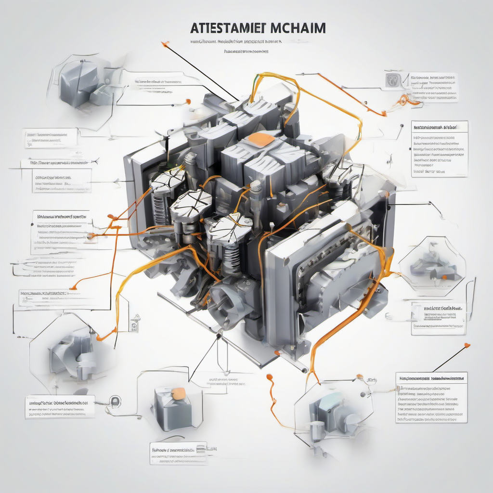

# Attention is All You Need Paper Explained
## Introduction to Attention is All You Need
The concept of attention in deep learning refers to the ability of a model to focus on specific parts of the input data that are relevant for the task at hand. 
* Introduce the concept of attention in deep learning: Attention allows models to selectively concentrate on certain inputs or features, improving performance and efficiency.
* Explain the limitations of traditional sequence-to-sequence models: Traditional sequence-to-sequence models rely on recurrent neural networks (RNNs) or long short-term memory (LSTM) networks, which can be limited by their sequential processing and fixed-length context.
* Highlight the key contributions of the Attention is All You Need paper: The Attention is All You Need paper introduced a novel architecture that relies entirely on self-attention mechanisms, eliminating the need for RNNs and LSTMs, and achieving state-of-the-art results in machine translation tasks.

## The Transformer Model Architecture
The Transformer model, introduced in the "Attention is All You Need" paper, revolutionized the field of natural language processing. At its core, the Transformer model consists of an encoder-decoder structure. 
* The encoder takes in a sequence of tokens, such as words or characters, and generates a continuous representation of the input sequence.
* The decoder then uses this representation to generate the output sequence, one token at a time.

Self-attention mechanisms play a crucial role in the Transformer model, allowing it to weigh the importance of different tokens in the input sequence relative to each other. This is particularly useful for tasks such as machine translation, where the context of a word can greatly affect its translation. 

The Transformer model also relies on positional encoding to preserve the order of the input sequence. Since the self-attention mechanism is permutation-invariant, the model would not be able to distinguish between different token orders without some form of positional information. 
Positional encoding adds a fixed vector to each token's representation, based on its position in the sequence, allowing the model to capture sequential relationships between tokens. 
This combination of self-attention and positional encoding enables the Transformer model to effectively process sequential data, making it a powerful tool for a wide range of NLP tasks.

## Applying the Transformer Model to Real-World Examples
The Transformer model, introduced in the "Attention is All You Need" paper, has been widely adopted in various NLP tasks. To apply this model to real-world examples, it's essential to understand its implementation and applications.
* A minimal code sketch of a Transformer model implementation can be represented as follows:
```python
import torch
import torch.nn as nn
import torch.optim as optim

class TransformerModel(nn.Module):
    def __init__(self):
        super(TransformerModel, self).__init__()
        self.encoder = nn.TransformerEncoderLayer(d_model=512, nhead=8)
        self.decoder = nn.TransformerDecoderLayer(d_model=512, nhead=8)

    def forward(self, src, tgt):
        encoder_output = self.encoder(src)
        decoder_output = self.decoder(tgt, encoder_output)
        return decoder_output
```
* The Transformer model has been highly effective in machine translation tasks, allowing for parallelization of the decoding process and improving overall translation quality.
* The Transformer model can also be applied to other NLP tasks, such as text classification, sentiment analysis, and question answering, by modifying the model architecture and training objectives to suit the specific task requirements.

## Common Mistakes and Challenges
When implementing the Transformer model, several common pitfalls can hinder its performance. 
* Proper hyperparameter tuning is crucial, as it directly affects the model's ability to learn and generalize.
* Training large Transformer models can be challenging due to their complexity and computational requirements, often leading to issues like overfitting or slow training times.
* Careful evaluation metrics are necessary to accurately assess the model's performance, as misleading metrics can lead to suboptimal results or incorrect conclusions about the model's effectiveness. 
By being aware of these potential issues, developers can take steps to mitigate them and ensure successful implementation of the Transformer model.

## Conclusion
The Attention is All You Need paper made significant contributions to the field of NLP, introducing a novel architecture that relies entirely on self-attention mechanisms. 
* The main contributions of the paper include the proposal of a transformer model that replaces traditional recurrent neural network (RNN) and convolutional neural network (CNN) architectures.
* The paper's impact on NLP has been substantial, enabling state-of-the-art results in various tasks such as machine translation and text generation.
* Future directions for research and application include exploring the use of attention mechanisms in other areas of NLP, such as question answering and text summarization, and applying the transformer model to other domains like computer vision.
