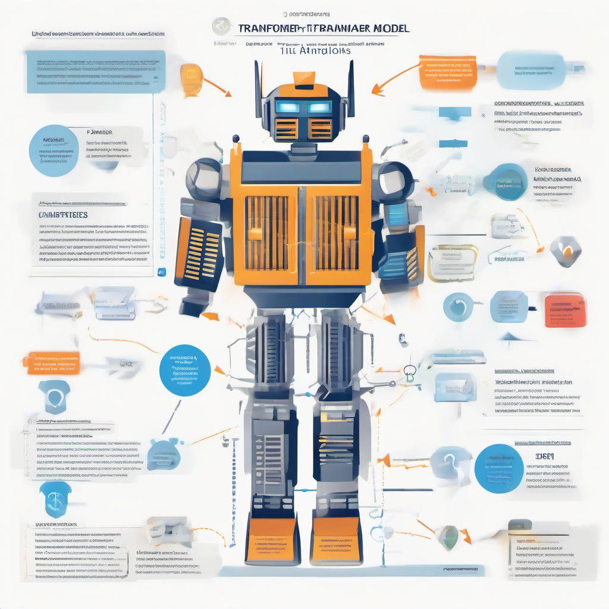
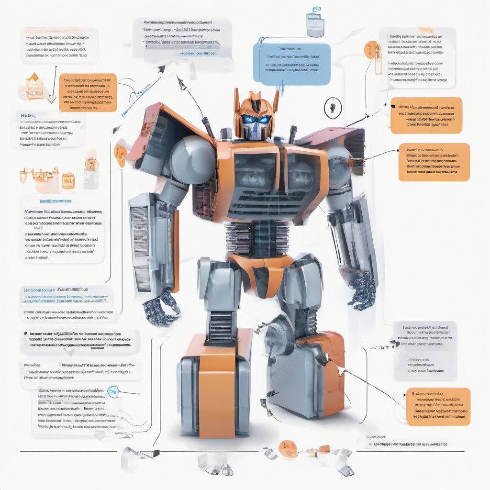

# Attention is All You Need Paper Explained
## Introduction
The concept of attention in deep learning has revolutionized the way models process sequential data. Attention allows models to focus on specific parts of the input data, weighing their importance when generating outputs. 
* Introduce the concept of attention in deep learning: Attention is a mechanism that enables models to selectively concentrate on certain elements of the input sequence, rather than considering the entire sequence equally.
* Explain the limitations of traditional sequence-to-sequence models: Traditional sequence-to-sequence models rely on recurrent neural networks (RNNs) or long short-term memory (LSTM) networks to encode and decode input sequences. However, these models suffer from limitations such as fixed-length context and sequential computation, which can lead to performance bottlenecks and difficulty in handling long-range dependencies.
* Motivate the need for a new approach: The limitations of traditional sequence-to-sequence models motivated the need for a new approach that can efficiently handle long-range dependencies and variable-length input sequences, leading to the development of the Attention is All You Need paper.

## Transformer Architecture
The Transformer model, introduced in the "Attention is All You Need" paper, revolutionized the field of natural language processing. At its core, the Transformer consists of an encoder-decoder structure. 
* The **encoder** takes in a sequence of tokens (e.g., words or characters) and outputs a sequence of vectors.
* The **decoder** generates the output sequence, one token at a time, based on the output vectors from the encoder.

The self-attention mechanism is a key component of the Transformer architecture. It allows the model to attend to different parts of the input sequence simultaneously and weigh their importance. This is achieved through a set of attention weights, which are computed based on the query, key, and value vectors. 
```python
import torch
import torch.nn as nn
import torch.nn.functional as F

class SelfAttention(nn.Module):
    def __init__(self, embed_dim, num_heads):
        super(SelfAttention, self).__init__()
        self.embed_dim = embed_dim
        self.num_heads = num_heads
        self.query_linear = nn.Linear(embed_dim, embed_dim)
        self.key_linear = nn.Linear(embed_dim, embed_dim)
        self.value_linear = nn.Linear(embed_dim, embed_dim)

    def forward(self, x):
        # Compute query, key, and value vectors
        query = self.query_linear(x)
        key = self.key_linear(x)
        value = self.value_linear(x)

        # Compute attention weights
        attention_weights = torch.matmul(query, key.T) / math.sqrt(self.embed_dim)

        # Compute output
        output = torch.matmul(attention_weights, value)
        return output
```
The role of positional encoding is to preserve the order of the input sequence, as the self-attention mechanism is permutation-invariant. This is achieved by adding a fixed vector to each input embedding, where the vector depends on the position of the token in the sequence. This allows the model to capture positional information and maintain the order of the input sequence.

## Applications of the Transformer Model
The Transformer model has been widely adopted in various natural language processing (NLP) tasks. Its ability to handle sequential data and capture long-range dependencies makes it an ideal choice for many applications.
* Showcase the use of Transformers in machine translation: The Transformer model can be used to improve machine translation tasks by allowing the model to focus on specific parts of the input sequence when generating the output sequence. This is particularly useful for languages with complex grammar and syntax.
* Discuss the application of Transformers in text summarization: Transformers can be used for text summarization by allowing the model to weigh the importance of different parts of the input text and generate a summary based on the most relevant information.
* Explore the use of Transformers in chatbots: Transformers can be used in chatbots to improve the model's ability to understand and respond to user input. This can be achieved by using the Transformer model to generate responses based on the context of the conversation.

Here is a minimal code sketch in Python that demonstrates the use of the Transformer model for text classification:
```python
import torch
import torch.nn as nn
import torch.optim as optim
from transformers import TransformerModel

# Define the model
model = TransformerModel()

# Define the input and output tensors
input_tensor = torch.randn(1, 10, 512)
output_tensor = model(input_tensor)

# Print the output shape
print(output_tensor.shape)
```
This code sketch demonstrates how to use the Transformer model for text classification tasks. However, the specific application of the model will depend on the task at hand and the requirements of the project. Performance and security considerations should also be taken into account when deploying the model in a real-world setting.

## Common Mistakes and Challenges
When implementing the Transformer model, several common pitfalls can hinder performance. 
* Proper hyperparameter tuning is crucial, as it directly affects the model's ability to learn and generalize.
* Overfitting is a significant risk, particularly when dealing with smaller datasets. To mitigate this, techniques such as dropout, early stopping, and regularization can be employed.
* Vanishing gradients are another potential issue, where the gradients used to update the model's weights become increasingly small, hindering the learning process. This can be addressed by using techniques like gradient clipping or norm.

## Conclusion
The Attention is All You Need paper introduces the Transformer model, a revolutionary approach to sequence-to-sequence tasks. 
* Recap the main contributions of the Attention is All You Need paper: The paper proposes a model that relies entirely on self-attention mechanisms, eliminating the need for recurrent neural networks (RNNs) and convolutional neural networks (CNNs).
* Emphasize the impact of the Transformer model on the field of deep learning: The Transformer model has significantly impacted the field, achieving state-of-the-art results in various tasks and becoming a foundation for subsequent research in deep learning, particularly in natural language processing.