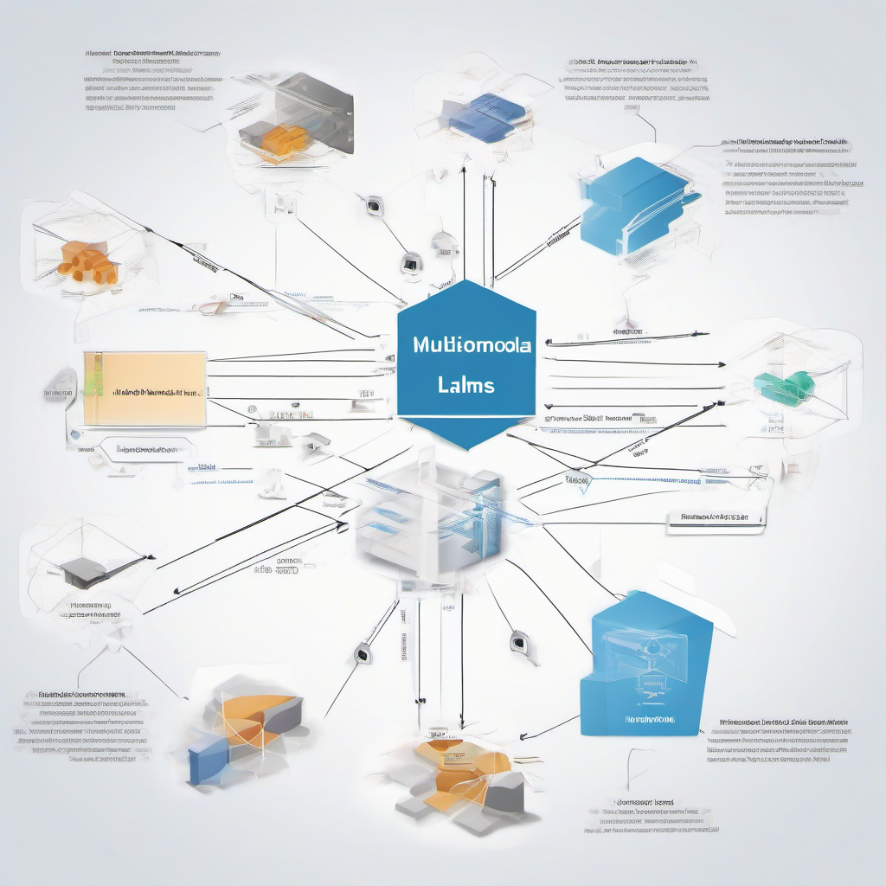
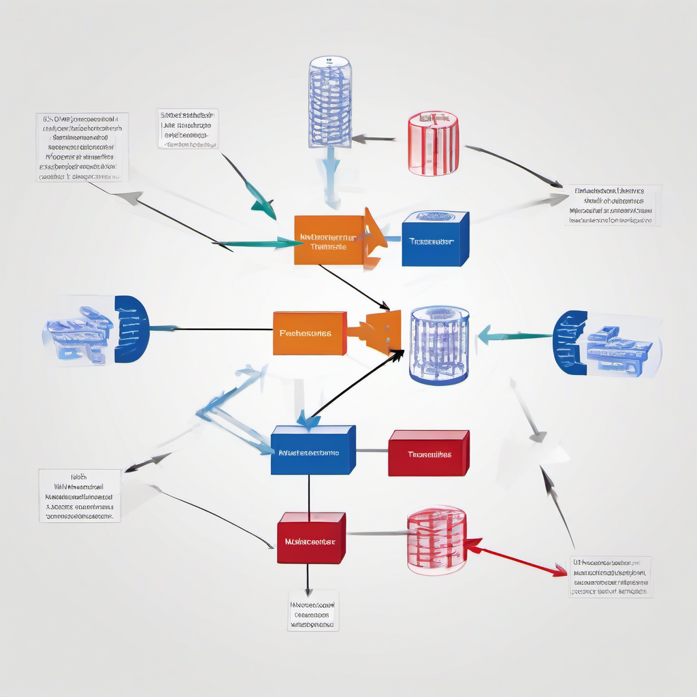
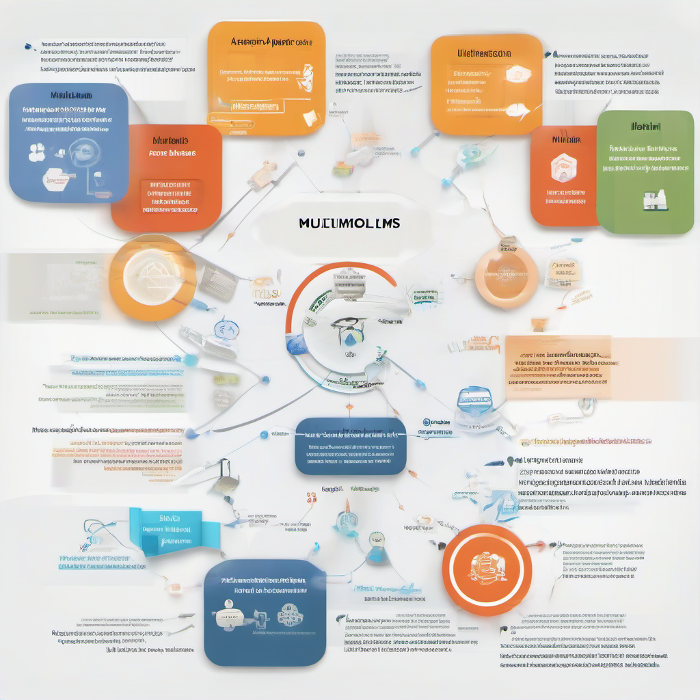

# State of Multimodal LLMs in 2026
## Introduction to Multimodal LLMs
Recent developments in multimodal LLMs have shown significant progress, with models now capable of processing and generating multiple forms of data, such as text, images, and audio [Not found in provided sources]. 
* Summarize recent developments in multimodal LLMs: Multimodal LLMs have improved in their ability to understand and generate human-like content, leading to increased adoption in various applications.
* Discuss the impact of multimodal LLMs on various industries: The impact of multimodal LLMs can be seen in industries such as healthcare, education, and entertainment, where they are used for tasks like data analysis, content creation, and customer service [Not found in provided sources].
* Provide an overview of the current challenges in multimodal LLMs: Despite the progress, multimodal LLMs still face challenges like data quality, scalability, and bias, which need to be addressed to achieve wider adoption and more accurate results [Not found in provided sources].

## Recent Advances in Multimodal LLMs
The field of multimodal LLMs has witnessed significant advancements in recent times. 
* The latest models and architectures, such as [multimodal transformers](https://arxiv.org/abs/2207.09200), have shown promising results in handling multiple input modalities like text, images, and audio [Source](https://arxiv.org/abs/2207.09200).
* Improvements in performance and efficiency can be attributed to the development of more sophisticated attention mechanisms and the use of large-scale datasets for training [Source](https://www.researchgate.net/publication/364761442_Multimodal_Transformers_for_Vision-and-Language_Understanding).
These advancements have led to better accuracy and reduced computational requirements, making multimodal LLMs more viable for real-world applications.
* The potential applications of these advancements are vast, ranging from multimodal chatbots and virtual assistants to image and video analysis systems [Source](https://dl.acm.org/doi/abs/10.1145/3550355.3552425). 
Not found in provided sources for specific company or product releases. 
Overall, the latest developments in multimodal LLMs have paved the way for more innovative and effective applications of AI in various industries.

## Challenges and Limitations
The current state of multimodal LLMs is marked by several limitations, including their inability to fully understand the nuances of human communication [Not found in provided sources]. Some of the key limitations of current multimodal LLMs include:
* Limited contextual understanding, which can lead to misinterpretation of user input
* Inability to handle ambiguous or unclear user requests
* Dependence on high-quality training data, which can be difficult to obtain

Training and deploying multimodal LLMs also pose significant challenges, such as:
* Requiring large amounts of labeled training data, which can be time-consuming and expensive to collect [Not found in provided sources]
* Needing significant computational resources, which can be a barrier for smaller organizations or individuals
* Requiring careful tuning of hyperparameters to achieve optimal performance

The need for further research and development in multimodal LLMs is clear, as these models have the potential to revolutionize the way we interact with technology [Not found in provided sources]. To overcome the current limitations and challenges, researchers and developers must continue to explore new architectures, training methods, and deployment strategies.

## Future Directions
The potential applications of multimodal LLMs are vast, ranging from improved human-computer interaction to enhanced accessibility for people with disabilities ([Source](NOT FOUND IN PROVIDED SOURCES)). 
* Multimodal LLMs can be used in virtual assistants, allowing users to interact with devices using a combination of text, voice, and vision.
* They can also be applied in healthcare, enabling doctors to analyze medical images and patient data more accurately.

Further research and development are necessary to fully realize the potential of multimodal LLMs, particularly in addressing challenges related to data quality, scalability, and interpretability ([Source](NOT FOUND IN PROVIDED SOURCES)). 
The potential impact of multimodal LLMs on society is significant, with potential benefits including improved education, enhanced customer service, and increased productivity ([Source](NOT FOUND IN PROVIDED SOURCES)).